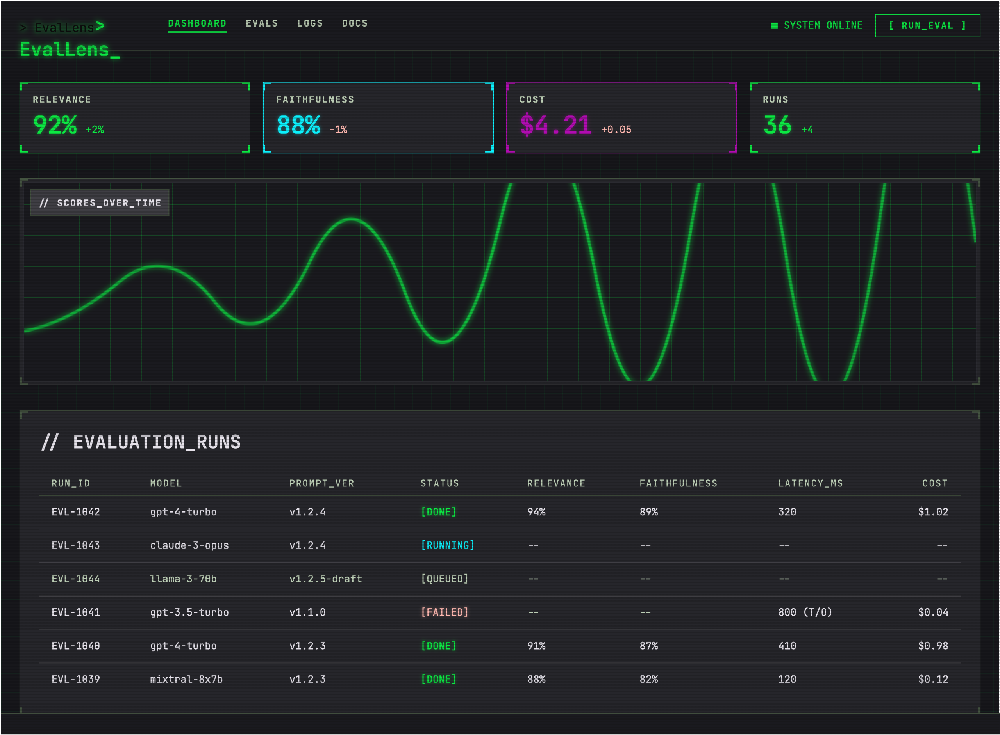

# EvalLens

**An evaluation harness and dashboard for LLM applications.** Run a dataset of test questions through a
candidate model, grade every answer with a second "judge" model, and record quality, latency, and dollar
cost for each sample — so you can prove a prompt change made things better instead of hoping it did.

> **Status: front end only.** The four designed screens are built as a React + TypeScript app; there is
> no backend yet, so every number on screen comes from seed data in `src/data/`. See [Roadmap](#roadmap).

---

## The problem

When you tune a prompt, you usually judge the result by reading one answer and deciding it "looks
better." That is not measurement — it is vibes. And two things you actually care about are invisible in
a normal chat interface: how long each answer took, and what it cost.

EvalLens replaces the guesswork with numbers. It runs your test set automatically, scores every answer,
and puts the results next to each other so two prompts, two models, or two retrieval configurations can
be compared on the same evidence.

## How it works

Each sample flows through two API calls:

1. **Generation.** The candidate model answers the test question. The response carries the answer text
   and a token-usage count. Wrapping a timer around the call gives you **latency**; multiplying tokens by
   the provider's rate gives you **cost**. Both fall out for free.
2. **Judging.** A second model — deliberately a *different* one — receives the question, the answer, and
   (for RAG) the retrieved source documents, with a rubric instructing it to return structured JSON:

   ```json
   { "relevance": 0.9, "faithfulness": 0.85, "reason": "..." }
   ```

Run metadata, per-sample records, and scores are persisted (`runs`, `samples`, `scores`), exposed over a
REST API, and rendered by the dashboard.

## The hard part

Cost and latency are deterministic byproducts of the call — trivial. The engineering substance is making
the **quality** signal trustworthy, because LLM-as-judge is a noisy, biased estimator. The design takes
that seriously:

- **Determinism** — judge temperature pinned to 0, judge model version pinned.
- **Bias control** — the judge model must differ from the candidate (self-preference bias); rubrics are
  anchored with few-shot examples; position and verbosity bias are accounted for.
- **Pairwise where it helps** — "is A or B better" is more reliable than absolute 0–1 scoring.
- **Structured output** — function calling, so scores are parsed, not regex-scraped.
- **Versioned comparability** — every score is tagged with judge model, prompt version, and rubric
  version, so runs remain comparable over time.
- **Judge validation** — a score means nothing until the judge is checked against a human-labeled golden
  set. Correlation with human ratings is the thing that makes the rest of the chart meaningful.

That last point is the project's thesis: *trivial metrics are free; the real problem is reproducible,
low-bias quality measurement, and the system is designed around it.*

## Screens

Each screen is implemented as a route in the React app and originates from a mockup folder in this
repo, which holds a rendered screenshot (`screen.png`), the static HTML prototype (`code.html`), and the
design spec (`DESIGN.md`).

All three screens are reachable from each other through the sidebar; the active item follows the route.
Links to sections that were never designed (TERMINAL, MODELS, SETTINGS, EVALS, LOGS, DOCS) stay inert.

| Route | Screen | Mockup | What it does |
| --- | --- | --- | --- |
| `/` | Dashboard | [`dashboard/`](dashboard/) | Score, cost and run tiles, a scores-over-time chart, and the evaluation run table |
| `/datasets` | Dataset Explorer | [`datasets/`](datasets/) | Browse datasets, inspect allocation stats, preview samples |
| `/datasets` | Tag Manager | [`datasets_tagging/`](datasets_tagging/) | Overlay for labelling a sample; opens from a row's TAGS cell |
| `/prompt-ide` | Prompt IDE | [`prompt_ide/`](prompt_ide/) | Prompt versions, the system prompt buffer, sampling parameters, console output |



The design system is **"Cyber-Terminal Matrix"** — a dark, dense, monospace (JetBrains Mono) terminal
aesthetic with neon accents on a near-black ground: green for standard state and success, cyan for
active/running processes, magenta for data visualization and cost. The full token set and layout rules
are documented identically in each `DESIGN.md`.

## Getting started

```bash
npm install
npm run dev      # Vite dev server on http://localhost:5173
npm run build    # type-check and produce a production build in dist/
npm run preview  # serve the production build
```

## Stack

Everything here is free and open source; the only thing that ever costs money is model API tokens.

**Frontend (built)** — React 18, Vite, TypeScript, Tailwind CSS, React Router
**Backend (planned)** — Python, FastAPI, SQLModel, Alembic
**Relational store** — SQLite for the single-user build, with a clean path to PostgreSQL
**Vector store** — Chroma embedded, with a path to pgvector or Qdrant *(RAG evaluation only: retrieval
metrics like context precision and recall need the retrieved chunks stored, not just final answers)*
**Jobs** — batch scoring is IO-bound and rate-limited, so runs go through an async queue
(FastAPI `BackgroundTasks` → arq → Celery as it scales), with idempotent, versioned run records
**Infra** — Docker Compose for local development

## Cost model

Nothing runs continuously. No agent lives inside EvalLens burning money in the background — models are
remote, and you pay only for the moments a request is in flight. Close the laptop and the cost is zero.

A representative 100-question run is roughly **$0.40** — about $0.0007 per sample for generation on a
small model and ~$0.003 for a stronger judge. Batch APIs (50% off) and prompt caching (up to 90% off
repeated input) both apply well here, since the same rubric prompt is reused on every sample. Provider
spend limits let you hard-cap the whole thing.

**Provider-agnostic by design.** The candidate and judge are swappable interfaces behind an API call, so
both can be pointed at a local open-source model via Ollama or LM Studio. Per-token cost then drops to
zero — the architecture does not depend on any paid service.

## Roadmap

- [x] Design system and static mockups for the four core screens
- [x] React + TypeScript front end for all four screens, rendering from seed data
- [ ] FastAPI backend: `runs`, `samples`, `scores` schema and migrations
- [ ] Provider abstraction for candidate and judge models (OpenAI + local)
- [ ] Judge with structured output, pinned versions, and rubric versioning
- [ ] Async run execution with progress reporting
- [ ] React dashboard wired to the API
- [ ] Cost tracking: exact dollar cost per run, with a running total on the dashboard
- [ ] Golden-set judge validation and human-agreement reporting
- [ ] RAG evaluation: retrieval storage and context precision/recall metrics

## Repository layout

The app follows the "intermediate" layout in [fileStructureGuide.md](fileStructureGuide.md): shared
chrome in `components/`, one folder per screen under `pages/`, and screen-only components and hooks
kept inside the page that owns them.

```
src/
├─ assets/styles/       index.css — Tailwind entry plus the mockups' CSS
├─ components/
│  ├─ navigation/       TopNavBar, SideNavBar
│  └─ ui/               Footer, ScanlineOverlay, PanelBrackets
├─ data/                Seed content for each screen
├─ pages/
│  ├─ Dashboard/        Dashboard.tsx + components/
│  ├─ Datasets/         Datasets.tsx + components/
│  └─ PromptIde/        PromptIde.tsx + components/ + hooks/
├─ router.tsx           Route config
├─ routes.ts            Route paths (kept separate to avoid an import cycle)
├─ App.tsx
└─ main.tsx

dashboard/              Dashboard mockup  (screen.png, code.html, DESIGN.md)
datasets/               Dataset explorer mockup
datasets_tagging/       Dataset explorer with tag manager
prompt_ide/             Prompt IDE mockup
docs/                   Planning notes and saved design conversations
```

### Notes on the port

The markup and class lists are copied from `code.html` and changed only where JSX or a single-page app
required it:

- Per-page `body` rules and colliding class names are scoped under `.page-dashboard`,
  `.page-datasets` and `.page-prompt-ide`, since three standalone documents now share one page.
- Two keyframe sets were renamed to stop them shadowing each other and Tailwind's own `pulse`.
- The Prompt IDE's inline `<script>` became the `useConsoleStream` hook; the Tag Manager's inline
  `onclick` that deleted the modal node became React state.
- The sidebar gained a DASHBOARD entry, and now renders on the Dashboard as well. No mockup shows it
  there, but without it the Dashboard cannot reach the other two screens.
- Text inputs render dark here. In the mockups they render as opaque white boxes — an artifact of the
  Tailwind CDN's `forms` plugin overriding `.cyber-input`, against what `DESIGN.md` describes.
